Node Red GFConnect
===========

## About
Node Red GFConnect is a Node-RED flow for controlling the Grainfather Connect (G30) brewing system from Raspberry Pi. It can be used as a replacement for the official Grainfather App.

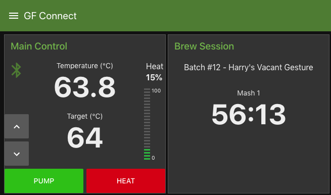

The following features are currently supported:
* Temperature control
* Pump control
* Heating power control
* Timer control (set, stop, pause, resume)
* Delayed heat control (set, stop, pause, resume)
* Loading of brew session from Brewfather batch json files
* Loading of brew session directly from Brewfather (preliminary Brewfather support)
* Delayed start of brew sessions
* Sending timer and brew session alerts as push notifications via Pushover

## Dependencies
* node-red-dashboard
* node-red-contrib-ui-level
* node-red-contrib-noble-bluetooth
* node-red-node-rbe

## Installation

The easiest way to install GFConnect is to copy the content of the [flow.json](flow.json) file into the workspace by selecting the menu "Import" -> "Clipboard":

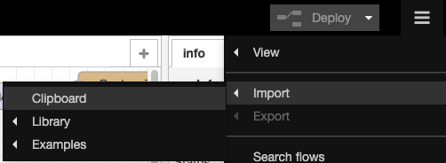</img>

Paste the content of flow.json into the "Import nodes" dialog, select to import to "new flow" and click the "Import" button.

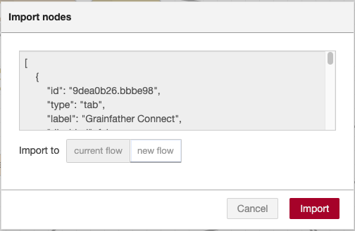</img>

In the workspace click the "Deploy" button to deploy the flow to the Node RED server. 

### Pairing with Grainfather Controller

The first time you run the GFConnect flow it will need to be paired with the Grainfather controller. Navigate to the top left corner of the editor and locate the blue "Grainfather Read" node.

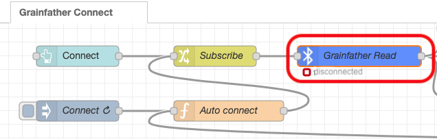</img>

If there is a red indicator and the text "disconnected" or similar below it, then you need to pair with the controller. First make sure the Grainfather controller is turned on and no other devices are connected to it. Double-click the blue "Grainfather Read" node to open the node editor and click on the pencil icon:

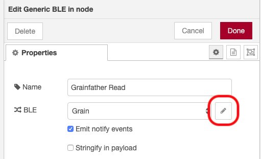</img>

In the next window, enable the option to "Select from scan result":

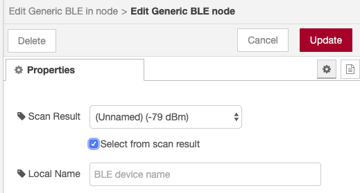</img>

All the discoverable Bluetooth nodes will now appear in the "Scan Result" popup. It may take a few seconds to fully populate the list and get the device names. If the Grainfather controller is found, there will now be an entry named "Grain" in the list. Otherwise, click the Cancel button and retry the scan process above.

Once the entry named "Grain" is found, select the entry and click on the "Update" button and next the "Done" button. 

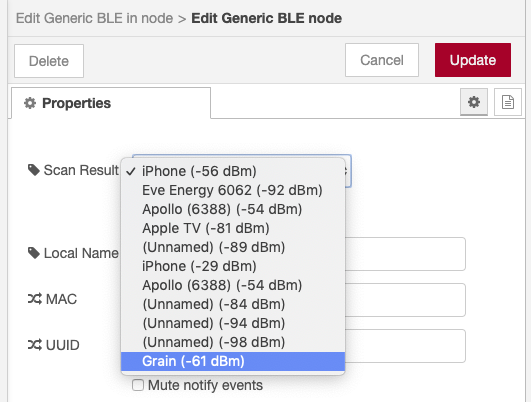</img>

Finally, click on the "Deploy" button in the editor to deploy the new confiuration to the server. Within a couple of seconds you should now have a successful connection to the Grainfather, indicated by green under the node:

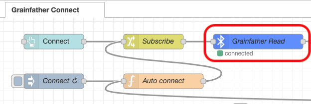</img>

The GFConnect dashboard can now be accessed from http://pi:1880/ui/ where *pi* is either the hostname or the ip address of your Raspberry Pi.

## Brew Sessions

In order to start a brew session you first need to establish a connection between the Grainfather controller and GF Connect. Then you navigate to the Brewfather File upload panel and upload the batch json file you have downloaded from the [Brewfather](https://web.brewfather.app/tabs/batches) brew planner website.

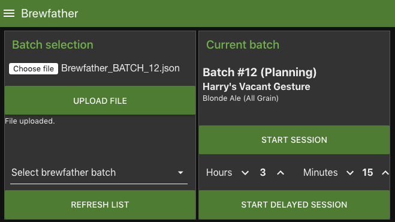

Click the "Upload File" button to load the recipe into the Raspberry Pi.

It is also possible to fetch the recipe directly from Brewfather. First click the "Refresh List" button to fetch a list of batches that are ready for brewing ("Planned" or "Brewing" status). Next select the batch from the drop down list to load it into the Raspberry Pi.

**Note:** Loading recipes directly from Brewfather is currently in preliminary testing phase. In order to use this feature you need to request a User Key and API Key directly from Brewfather and entered these in the GF Connect settings. See [docs.brewfather.app/api](https://docs.brewfather.app/api) for details.

Once the recipe is loaded, you can start the brew session by clicking "Start Session". Alternatively you can delay the session start by setting the number of hours and minutes and clicking the "Start Delayed Session". The recipe will now be sent to the Grainfather controller and you can start brewing:

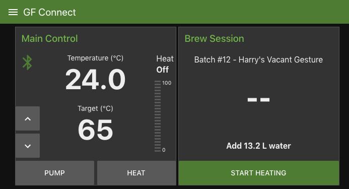

You will now be able to control the brew session from the GFConnect panel or from the Grainfather controller.

## Configuring Push Notifications

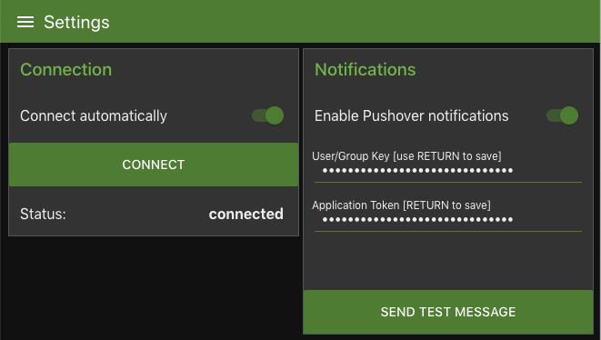

GF Connects support push notifications which are delivered via the Pushover App.

To set up push notifications for brew events, e.g. when a timer expires, you will need to enter your Pushover user key and API key into the Notification settings. You will need to register for a new API Key in Pushover. It is also possible to use a group key instead of a user key so more than one user can receive the notifications.

The Pushover keys are avaliable through the [Pushover Dashboard](https://pushover.net/)

## Contributions
* [Claus Broch](https://github.com/clausbroch) - Main author of the Node RED flow for connecting to Grainfather
* [Kingpulsar](https://github.com/kingpulsar) - This project wouldn't have been possible without his reverse engineering of the Grainfather bluetooth protocol - See [kingpulsar/Grainfather-Bluetooth-Protocol](https://github.com/kingpulsar/Grainfather-Bluetooth-Protocol) for more information

## License
This project is licensed under the MIT License - see the [LICENSE](LICENSE) file for details.
